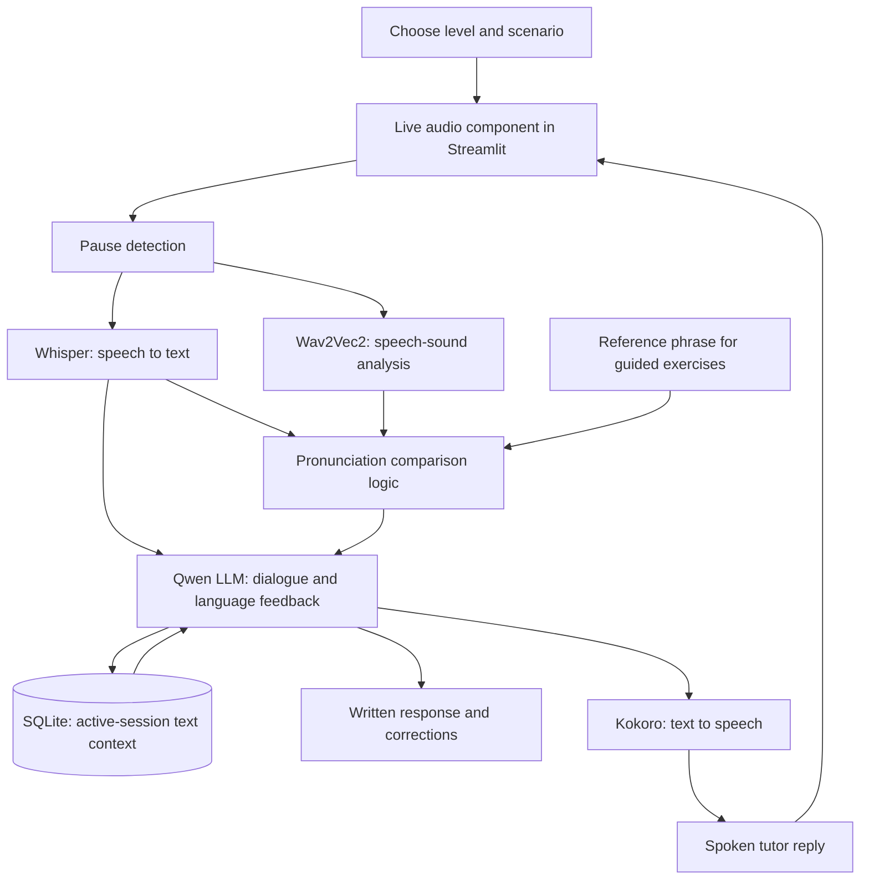

# SpeakWell

### A Multilingual AI Language Tutor

SpeakWell is a proposed voice-based language-learning application designed to help users practice multiple languages with a virtual AI tutor. Learners will speak into a microphone, hear the tutor respond, and receive targeted feedback on grammar, vocabulary, coherence, and pronunciation.

**English is the initial proof of concept (PoC).** It will be used to develop and validate the core speaking and feedback experience before adding other languages. The broader product is a multilingual language tutor; support for additional languages has not yet been implemented or validated.

**Project status: Recorded-turn voice input implemented (Milestones 0–5).** Record a short English message, transcribe it locally, review/edit the text, then send it through the existing tutor and SQLite history. Typed input remains available. See [recorded voice setup and verification](docs/recorded_voice.md); live turn detection, spoken replies, and pronunciation assessment remain planned. Model feedback is still inaccurate in observed cases.

**Milestone 6:** Testing and evaluation completed with documented failures in
feedback quality, recall, and response time. See [evaluation evidence](docs/evaluation.md).

**Milestone 7:** Freeze preparation is verified; the user will create the commit
and `mvp-v1` tag. See [checkpoint and recovery instructions](docs/mvp_freeze.md).
A checkpoint will preserve known limitations, not mark feedback quality or the two-second target as passed.

## Why SpeakWell?

Language learners may understand grammar and vocabulary but have limited opportunities to practice conversation in their target language. SpeakWell aims to provide accessible, repeatable practice in a low-pressure environment without paid APIs.

The tutor will help learners communicate clearly and confidently. It will focus on understandable speech rather than eliminating accents, and will supplement classroom learning and human instruction.

## Planned Features

- **Multilingual direction:** Develop a reusable tutoring experience for multiple languages, starting with an English-only PoC.
- **Voice-based interaction:** Speak through a microphone and receive spoken responses.
- **Automatic turn-taking:** Detect a pause before processing the learner’s turn and replying.
- **Personalized language feedback:** Receive one or two actionable suggestions about grammar, vocabulary, or how clearly ideas connect.
- **Pronunciation practice:** Listen to examples, repeat phrases, and receive experimental feedback grounded in audio analysis.
- **Three practice levels:** Choose beginner, intermediate, or advanced activities.
- **Everyday scenarios:** Practice introductions, ordering food, and discussing daily activities.
- **Written support:** Review transcripts, corrected examples, and feedback alongside audio.
- **Session context:** Keep the current conversation’s text turns and feedback in SQLite.

## Practice Levels

| Level | Activity | Intended feedback |
|---|---|---|
| Beginner | Listen to and repeat short phrases | Guided corrections and spoken examples |
| Intermediate | Read short passages aloud and answer structured questions | Basic audio-based pronunciation feedback and language corrections |
| Advanced | Discuss everyday topics freely | Grammar, coherence, and selective pronunciation feedback supported by audio analysis |

These levels are practice modes, not certified proficiency assessments. Pronunciation assessment during spontaneous conversation is experimental.

## Intended User Experience

1. Open the application and select a practice level and scenario.
2. Enable microphone access and begin speaking.
3. Pause to allow the tutor to process the turn.
4. Listen to the tutor’s reply and review written feedback.
5. Retry a phrase or continue the conversation.

### Example Interaction

**Learner:** “Yesterday I go to the store.”

**Tutor:** “You can say, ‘Yesterday I went to the store.’ Use ‘went’ because the action happened in the past. What did you buy?”

The interface will show the corrected sentence while playing the spoken reply. This is an illustrative example, not output from a working application.

## Planned Workflow

The LLM will use the transcript and conversation context to generate replies and language feedback. A separate audio-analysis component will provide evidence for pronunciation suggestions. Transcription errors alone will not be treated as pronunciation errors.

## Proposed Technology Stack

| Component | Tool | Purpose |
|---|---|---|
| Language | Python | Application logic and model integration |
| Runtime | Local Python | Run Streamlit and the voice backend on the developer’s computer; validate hardware performance before deployment |
| Interface | Streamlit | Practice controls, transcripts, feedback, and an embedded live-audio component |
| LLM | Qwen3-1.7B via Ollama (proposed lightweight default) | Tutor dialogue and grammar, vocabulary, and coherence feedback |
| Model inference | Ollama for Qwen; Hugging Face Transformers for Wav2Vec2 | Run the language and pronunciation models |
| Speech recognition | Whisper base.en through faster-whisper (English PoC benchmark candidate) | Convert English speech to text; use a multilingual checkpoint when adding other languages |
| Speech synthesis | Kokoro-82M | Generate spoken replies and examples |
| Audio analysis | Wav2Vec2 phoneme recognition | Recognize speech-sound labels for custom pronunciation analysis |
| Database | SQLite | Store text turns and feedback for the active session |
| Distribution | GitHub | Share source code, documentation, and local startup instructions |

Start with Ollama’s quantized `qwen3:1.7b` and disable thinking with `think: false` for conversational replies. Keep replies brief and initially cap the context at 4,096 tokens. These are proposed defaults, pending tutoring-quality and latency tests. Pause detection and browser audio integration still require implementation and testing.

## Streamlit Frontend and Proposed Voice Integration

Streamlit replaces Gradio as the selected frontend. It will provide the level and scenario selectors, session controls, conversation history, and written feedback.

Streamlit's built-in `st.audio_input` returns completed recordings and can support a recorded-turn prototype. Continuous conversation requires additional browser audio integration. The proposed approach is a custom Streamlit component wrapping Pipecat's JavaScript client and SmallWebRTC transport, connected to a separate Python voice backend. This integration is planned and has not been validated.

In this approach, Pipecat would coordinate transcription, turn detection, LLM responses, and speech synthesis. Whisper, Qwen, Kokoro, SQLite, and custom pronunciation analysis would remain separate components. Live audio would travel directly between the browser component and voice backend; Streamlit would receive session events and feedback rather than process every audio chunk through script reruns. The component must preserve its connection across UI updates and release microphone resources when the session ends.

See [Streamlit audio input](https://docs.streamlit.io/develop/api-reference/widgets/st.audio_input) and [custom components](https://docs.streamlit.io/develop/concepts/custom-components/intro).

## Running the App

Follow [Environment Setup](docs/environment_setup.md), then the [Streamlit launch and verification guide](docs/streamlit_ui.md). The working UI is text-only; the voice workflow elsewhere in this README remains the planned product vision. The [terminal LLM component](docs/llm_call.md) remains available independently.

For structured language feedback, add `--tutor` and a learner sentence. See
[Tutoring Prompt Design](docs/tutoring_prompt.md) for the full command guide and
[live evaluation results](docs/tutoring_evaluation.md) for the current limitations.

The application will run locally instead of in Google Colab. The proposed local setup includes:

- A browser with microphone access and audio playback.
- Local Python processes for Streamlit and the Pipecat voice backend.
- Ollama serving the quantized `qwen3:1.7b` model with thinking disabled.
- Whisper `base.en`, Kokoro, and Wav2Vec2 for speech processing.
- SQLite for session text and feedback.

### Target Hardware and Model Defaults

The target computer has a 2.4 GHz 8-core Intel Core i9, Intel UHD Graphics 630, and 32 GB DDR4 RAM. Budget: no paid APIs, hosting subscriptions, or paid compute for the initial project.

Ollama supports Intel Macs through CPU inference; the Intel integrated GPU will not accelerate this Ollama setup. Its current macOS requirement is Sonoma 14 or newer, which must be checked before installation. The available RAM gives room for the proposed small models, but CPU latency is the main feasibility question. No speed measurements have been made.

- Default LLM: quantized `qwen3:1.7b`, with thinking disabled, a 4,096-token context, and brief spoken replies. Ollama lists a download of approximately 1.4 GB, excluding runtime memory and other models.
- Optional quality comparison: `qwen3:4b-instruct` (approximately 2.5 GB download). Only choose it over 1.7B if measured correction quality improves enough to justify its response time.
- Speech recognition: start with faster-whisper `base.en` on CPU with INT8 compute. Benchmark `tiny.en` only if transcription is too slow, checking the impact on learner-speech accuracy.
- Speech output: benchmark Kokoro on CPU.
- Pronunciation: queue Wav2Vec2 analysis after the initial reply generation so it does not compete with the most latency-sensitive step. Return additional feedback tied to the relevant turn.
- Initial concurrency: one learner. Benchmark before promising a fixed response time or multiple simultaneous sessions.

### Free Deployment Plan

**Primary demo: self-host the complete app on the target Mac and publish the code and setup instructions on GitHub.** This has no additional hosting or inference-service fees and matches the assignment’s allowance for local execution. GitHub hosts the repository, not the running Python application. The learner opens the local Streamlit URL in a browser.

**Optional public frontend: Streamlit Community Cloud.** It offers free Streamlit hosting, but the models and Pipecat backend would still run on the Mac. This is an optional integration experiment, not a promised always-on deployment. The Mac must stay awake and reachable, and the frontend must show when the backend is unavailable. A remote server cannot access the developer’s Ollama through `localhost`.

For this optional public setup, validate HTTPS signaling, session authentication, microphone permissions, and WebRTC connectivity to the local backend. STUN/TURN may be necessary; an HTTPS tunnel alone does not guarantee audio connectivity. Proceed only if the required connectivity can be provided at no charge. Keep Ollama internal to the backend. If networking cannot meet the free constraint, retain the fully local demo rather than introduce a paid dependency.

Do not assume a free frontend host has enough resources to run the full speech and language model stack. Paid VMs and GPU services are outside the current scope. No cloud deployment, tunnel, or public endpoint has been created.

Sources: [Ollama macOS support](https://docs.ollama.com/macos), [1.7B model](https://ollama.com/library/qwen3:1.7b), [4B comparison model](https://ollama.com/library/qwen3:4b-instruct), [thinking controls](https://docs.ollama.com/capabilities/thinking), [Streamlit Community Cloud](https://docs.streamlit.io/deploy/streamlit-community-cloud), [SmallWebRTC requirements](https://docs.pipecat.ai/api-reference/server/services/transport/small-webrtc).

## Data and Session Handling

- Inputs will consist of learner speech and original practice prompts or reference passages.
- Pretrained models will be used without fine-tuning; no custom training dataset is planned.
- Text turns and feedback will be stored in SQLite for the active session. Persistent learner profiles are outside the initial scope.
- Raw recordings will not be retained by default; temporary audio will be needed for processing.
- In the local configuration, speech and model inference remain on the local backend. In a hosted configuration, speech is sent to the selected backend for processing.
- No document retrieval or vector database is planned.

## Limitations

- **Response time:** The goal is near-real-time turn-taking, with replies after pauses. Latency depends on model performance, connectivity, and available compute.
- **Pronunciation feedback:** Wav2Vec2 produces speech-sound labels, not validated pronunciation grades. Custom comparison logic and human evaluation are required.
- **Open conversation:** Assessing pronunciation without a known reference phrase is more difficult; advanced-tier feedback will be selective and experimental.
- **Recognition quality:** Noise, microphone quality, and speech variation can affect transcription and analysis.
- **Feedback quality:** Model-generated corrections may be inaccurate and require evaluation.
- **Initial coverage:** The PoC will support English and a small set of everyday scenarios. Broader multilingual support is a product goal, not a capability of the initial release.

## Expanding Beyond the English PoC

The English examples and English-specific speech models in this README describe the first validation stage. Adding a language will require a suitable speech-recognition model, a supported speech-synthesis voice, localized tutor prompts and exercises, and language-specific pronunciation references and evaluation. The English-only `base.en` and `tiny.en` checkpoints must be replaced for other languages.

Each additional language will be tested across transcription, conversation, spoken output, and feedback before being offered to learners. A multilingual LLM alone does not establish end-to-end language support. The next languages will be selected after the English PoC is evaluated.

## Development Roadmap

- [x] Define the project concept, learner tiers, and proposal.
- [x] Set up and verify the local Python/Ollama environment (Milestone 0).
- [x] Call the local LLM from Python with one prompt, basic error handling, and offline tests (Milestone 1).
- [x] Add level/scenario tutoring prompts, validated reply/feedback JSON, and live text evaluations (Milestone 2).
- [x] Save completed turns in SQLite and reload bounded context for the same session (Milestone 3).
- [x] Build the text-first Streamlit UI with settings, transcript, feedback, counter, and saved-session refresh recovery (Milestone 4).
- [x] Add local recorded-turn transcription and editable transcript review (Milestone 5); personal microphone/voice validation remains a manual checkpoint.
- [x] Complete the testing/error-handling/evaluation pass with known quality failures and measured timings (Milestone 6).
- [ ] Create local `mvp-v1` commit/tag after freeze verification (Milestone 7; user-managed Git step).
- [ ] Validate model memory usage and inference speed on the chosen runtime.
- [ ] Validate the proposed Streamlit component and Pipecat audio connection, including UI reruns and session cleanup.
- [ ] Implement microphone input, pause detection, and speech transcription.
- [ ] Connect the LLM, session context, and spoken output.
- [ ] Add beginner, intermediate, and advanced practice flows.
- [ ] Implement and evaluate experimental pronunciation feedback.
- [ ] Test end-to-end sessions and document measured response times.
- [ ] Publish verified local startup instructions on GitHub.
- [ ] Verify the fully local demo and GitHub setup instructions; optionally test a free public frontend with the local backend.
- [ ] Prepare the final project documentation and presentation.
- [ ] After validating the English PoC, select and evaluate additional languages across the full speech and tutoring pipeline.

## Evaluation

The initial success criterion is completing a short spoken practice session in each tier without paid APIs. Testing will assess:

- Relevance and continuity of tutor responses.
- Accuracy and usefulness of language corrections.
- Reliable microphone capture, turn detection, and audio playback.
- Pronunciation feedback compared with human review, including false corrections.
- Time from the end of learner speech to the beginning of the tutor’s spoken reply.
- Handling of silence, unclear recordings, and unavailable compute resources.

### Milestone 6 evaluation (2026-09-22)

**Focused follow-up (2026-09-24):** Added balanced development/held-out datasets
and an opt-in prompt comparator. On 20 development inputs, the baseline falsely
corrected all 10 valid sentences; a shorter conservative prompt left them alone
but missed explicit feedback on all 10 erroneous sentences. The candidate was
rejected and the application default retained. The 20 held-out cases remain
reserved for a candidate selected on development results. [Experiment and
verification guide](docs/feedback_quality.md). The expanded suite has 101 tests.

96 automated tests and Ruff checks pass. Shared error codes now distinguish
unavailable Ollama, invalid tutor output, speech errors, and storage failures;
tested failures preserve drafts and do not save failed turns.

| Live text input | Feedback rating (1–3) | Observed result |
|---|---:|---|
| Yesterday I go to the store. | 3 | Correct go → went |
| I enjoy hiking with my friends. | 1 | False correction to valid hiking |
| My brother work in a bank. | 3 | Correct work → works |
| I usually hike on Saturdays. | 1 | False correction to hikes |
| Where does my brother work? | 1 | False pronoun correction; failed recall |

These are assistant qualitative ratings, pending learner/instructor review.
All five turns completed, but **feedback quality remains a failed gate**.
Text Send-to-render median was **4.061 s**; five repeated recorded-audio
processing turns had median **5.572 s**, excluding capture, human review, and
spoken output. The two-second target is unmet. See [Milestone 6 evidence and
verification commands](docs/evaluation.md) for test coverage, exact responses,
timing boundaries, and exercises; these small samples are not a general benchmark.

## Project Context

SpeakWell is an AI developer class project. The intended application will demonstrate user input, an existing open-source LLM, LLM-generated output, a lightweight interface, and a database for conversation memory. The initial development scope assumes an experienced developer and at least four weeks.

## References and Licensing

- [Qwen3-1.7B](https://huggingface.co/Qwen/Qwen3-1.7B) — proposed lightweight LLM, with Apache 2.0 licensing.
- [Ollama](https://ollama.com/library/qwen3:1.7b) — local LLM inference.
- [Hugging Face Transformers](https://github.com/huggingface/transformers)
- [faster-whisper](https://github.com/SYSTRAN/faster-whisper)
- [Kokoro](https://github.com/hexgrad/kokoro)
- [Wav2Vec2 phoneme-recognition model](https://huggingface.co/facebook/wav2vec2-lv-60-espeak-cv-ft)
- [Streamlit](https://docs.streamlit.io/)
- [Pipecat pipelines](https://docs.pipecat.ai/pipecat/learn/pipeline)
- [Pipecat SmallWebRTC](https://docs.pipecat.ai/api-reference/server/services/transport/small-webrtc)

A license for SpeakWell’s own source code has not yet been selected. Third-party models and libraries remain subject to their respective licenses.
