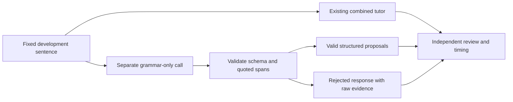

# Separate grammar analysis experiment — 2026-09-29

## What changed

`grammar.py` is an isolated experiment: one reviewed learner message enters a
grammar-only prompt and returns a `corrections` array. Each correction has exact
`original` words, a `replacement`, and an `explanation`. The shared local client
accepts an optional schema and model override; existing tutor calls retain their
model, prompt, schema, retry policy, history, and UI behavior.

The experiment is **not wired into Streamlit**. In particular, the existing app
still shows the original combined tutor's feedback. Recording → editable
transcript → Send is unchanged. No corrections are applied to learner text
automatically, and no learner history is written by the grammar evaluator.



## What validation can and cannot do

The parser checks field names/types/lengths, at most two corrections, original
words actually present at word boundaries, nonidentical replacements, and
duplicate original spans. Whitespace-only or Unicode-normalization-only changes
are rejected; meaningful capitalization corrections remain possible.

One bad entry rejects the entire response. Raw output is preserved for audit;
rejection is not converted into an empty list or a claim that English is correct.
The grammar experiment makes one attempt, without retrying until a superficially
acceptable answer appears. Service failure is a separate error.

These are **mechanical checks**, not semantic proof. For example, the 1.7B model
changed valid “near” to “away from,” reversing meaning, yet both fields satisfied
the mechanical rules. The 4B model quoted the existing word “is” but proposed
“cheaper” to fix “more cheaper”—an incorrect replacement location that also
passed. Human review must judge replacement, explanation, and preserved meaning.
Repeated occurrences/overlapping spans are not resolved for automatic editing;
automatic editing is intentionally absent.

## Experiment design and evidence

1. Run all 20 development sentences through the unchanged combined baseline
   and the 1.7B grammar-only path, alternating order, using the same sampling
   settings and 256-token output budget. Grammar does not receive level/scenario
   instructions or conversation history; it has one focused job.
2. Because quality remained poor, compare one larger local model with the exact
   same grammar prompt, schema, parser, and development set: `qwen3:4b`.
3. Review correctness separately from accepted/rejected status. Choose a
   candidate for held-out validation before inspecting held-out results.
4. Preserve the existing conversation control run separately. Grammar quality
   does not establish recall, grounding, or follow-up quality.

Qwen3 4B was downloaded into the project's ignored model cache (about 2.5 GB).
The publisher documents Apache 2.0 licensing for Qwen3; the local Ollama tag's
full digest is recorded in the results. [Ollama model listing](https://ollama.com/library/qwen3/tags),
[Qwen licensing](https://github.com/QwenLM/Qwen3).
This is one alternative model comparison, not proof that parameter count alone
caused the difference. Quantization/model revision and host loading matter.
The local `/api/ps` response showed 4B running with `size_vram: 0`, confirming
CPU execution, at a 4,096-token context. The experimental model was unloaded
after testing to release memory; its downloaded weights remain cached.

Development findings, based on assistant review (independent human review pending):

| Measure | Combined 1.7B | Grammar-only 1.7B | Grammar-only 4B |
|---|---:|---:|---:|
| Correct inputs receiving accepted false corrections | 10/10 | 8/10 | 0/10 |
| Rejected responses on correct inputs | 0 | 2 | 0 |
| Useful corrections with accurate explanations on incorrect inputs | 6/10 | 2/10 | 6/10 |
| Rejected responses on incorrect inputs | 0 | 2 | 1 |
| Median call time | 3.756 s | 1.821 s | 2.489 s |
| Maximum call time | 11.646 s | 4.096 s | 9.447 s |

The two rejected 1.7B outputs on correct inputs also contained unsupported
proposals. Thus it proposed false feedback on **all ten** correct cases before
validation; hiding rejected outputs would inflate the apparent improvement.
Some correct replacements had wrong or unhelpful explanations and were not
counted as fully useful. Every judgment remains available for review.

Timing includes only a single model request plus validation (and baseline format
retry if needed). No baseline format retry occurred in the development run.
These measurements exclude STT, UI, human review, and spoken output; cold/warm
loading and host workload were not controlled. The 4B first call took 9.447 s.
Do not add the medians and call the sum a measured end-to-end latency. A separate
pass would add work, and the two-second conversational target remains unresolved.

The five-turn conversation control completed and saved five turns, but still
repeated a follow-up and ignored “Where does my brother work?” even though the
bank was in prior context. Its false corrections remain. This path was not
changed to make the grammar experiment look better.

Key files under `evaluation/`:

- `grammar_development_results.json`: 40 current-model comparison calls.
- `grammar_development_review.json`: assistant semantic judgments.
- `grammar_4b_development_results.json`: 20 larger-model grammar calls.
- `grammar_selection.json`: development-based selection recorded before validation.
- `grammar_conversation_control.json`: separate original-app conversation run.

## Held-out validation and final decision

The 4B configuration preserved the baseline's six useful development corrections
while eliminating false corrections on acceptable development inputs. It was
therefore selected for validation—not deployment—before viewing held-out outputs.
The prompt, schema, parser and settings stayed fixed throughout both held-out runs.

| Held-out measure | Run 1 | Run 2 |
|---|---:|---:|
| Correct sentences appropriately left unchanged | 10/10 | 10/10 |
| Useful corrections with accurate explanations | 4/10 | 5/10 |
| Rejected responses on erroneous inputs | 1 | 1 |
| Meets 9/10 useful-correction target | No | No |

The second run's improved item supplied the right base-verb explanation after
“does.” The first run returned the right replacement but a contradictory,
unfinished explanation. Other failures included omitting “more” from a
comparative, inserting “ten years” in place of “ten” (duplicating “years”), and
missing the article error in “an university.” Both article responses were rejected
because they proposed identical original/replacement words.

**Final decision: do not adopt either configuration in the app yet.** The 4B
model reduces overcorrection on this small sample, but does not provide enough
reliable error correction. No certainty beyond these labeled cases is implied.
There is no grammar-only conversational reply to grade; the separate conversation
control continues to evaluate the unchanged tutor. Scores remain assistant
review pending independent human judgment.

See `grammar_4b_heldout_results.json`, `grammar_heldout_review.json`, and
`grammar_final_decision.json` for the recorded evidence. The held-out set has now
been evaluated. If its outputs influence another prompt revision, retire it from
held-out use and prepare new examples before claiming unseen-case validation.

## Verify and learn

The historical regression run left all four acceptable inputs unchanged and
returned the expected edits on both erroneous inputs. The past-tense explanation
was weak/tautological, while the agreement explanation was accurate. These familiar
cases do not override the failed held-out gate; see `grammar_4b_regression_results.json`
and `grammar_regression_review.json` for details.

Run from the project directory:

```bash
cd /Users/lovejit/PerScholas/AI_Solutions_dev/CAPSTONE/AI_Dev_CAPSTONE/lang_app
```

**Purpose/typical use:** Sets the working directory before invoking project tools.
**Expected:** No output on success.

```bash
uv run --locked python -m pytest -q
```

**Purpose/typical use:** Runs regression tests after implementation changes using
locked dependencies. **Expected:** `131 passed in ...`; no live model is needed.
Tests include a deliberately incorrect suggestion that passes mechanical checks,
demonstrating why semantic review is still needed.

With the existing Ollama service running:

```bash
uv run --locked python grammar_eval.py --split development --output .tools/grammar-repeat.json
```

**Purpose/typical use:** Compares the existing combined tutor against isolated
grammar analysis on the same 20 development cases; use for controlled experiments.
**Expected, variable:** `development-01 baseline valid: ...s` and
`development-01 grammar_only valid: ...s`, with some possible `rejected` entries.
Each attempt is saved. Exit code 1 means at least one service error or rejected
response was observed; inspect the report rather than interpreting it as a crash.
Use a new output filename for each run—previous evidence cannot be overwritten.

The 4B model is already downloaded on this machine. On a new setup:

```bash
bash scripts/ollama.sh pull qwen3:4b
```

**Purpose/typical use:** Downloads the optional public comparison model into the
project's model cache; use once before testing that model.
**Expected:** Progress followed by `success`. This does not change the app's model.

```bash
uv run --locked python grammar_eval.py --split development --grammar-only --grammar-model qwen3:4b --output .tools/grammar-4b-repeat.json
```

**Purpose/typical use:** Runs only the isolated grammar experiment with the named
local model, keeping conversation generation unchanged.
**Expected, variable:** 20 `grammar_only` status/timing lines and a summary.
`valid` means schema/span checks passed; it does not mean grammatically correct.

Small Python REPL exercise (Ollama must be running):

```python
from grammar import check_grammar

# Read both the validation status and the proposed explanation.
result = check_grammar("She walk to work every morning.", model="qwen3:4b")
print(result)
# TODO: Try an original correct sentence and review whether feedback is justified.
```

**Illustrative output:** `status: valid`, with `original: walk`, `replacement:
walks`, and an explanation of third-person singular agreement. Model wording
can vary. Compare this with a rejection: rejection means the proposed response
cannot be used, not that your input is error-free.

Explain why exact quoted words can still support an incorrect correction, why
changing “two” to “a” does not preserve meaning, and why separate feedback time
must be measured before integrating a second call into the app. Inspect the raw
outputs before proposing another prompt edit. No Git operations are performed
by the assistant.
