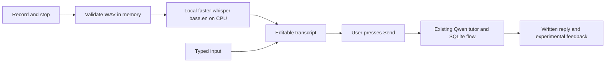

# Milestone 5 — Recorded-Turn Voice Input

## What you are learning

Speech recognition turns sound into text; it does not judge pronunciation.
The microphone produces a completed WAV recording, a file containing audio
samples. `stt.py` checks its format, length, and energy, then uses `base.en` to
transcribe locally on the CPU. INT8 quantization uses reduced-precision model
calculations to lower resource use. VAD (voice activity detection) filters
non-speech inside a finished clip; it does not implement automatic live turns.

Read `decode_recording()`, `get_model()`, and `transcribe_audio()` in that order.
The model returns a lazy iterator: transcription can fail while iterating over
segments, so the error handler encloses that loop. The loaded model is reused
across calls, and a lock serializes transcription to limit CPU competition.



## Setup and verification

### 1. Enter the project

```bash
cd /Users/lovejit/PerScholas/AI_Solutions_dev/CAPSTONE/AI_Dev_CAPSTONE/lang_app
```

**Purpose and typical use:** `cd` selects the working directory so subsequent
commands use this project's files. It normally produces no output on success.

### 2. Synchronize dependencies

```bash
uv sync --locked
```

**Purpose and typical use:** Installs the exact dependency versions in `uv.lock`;
use it after cloning the project or receiving dependency changes.

**Expected snippets:** `Resolved ... packages`, then `Installed ... packages` or
`Checked ... packages`. This verifies the locked environment can be installed.

The Intel Mac constraint in `pyproject.toml` makes `uv` require compatible wheels.
The installed versions were faster-whisper 1.2.1, CTranslate2 4.8.2, ONNX Runtime
1.23.2, and PyAV 18.1.0. Newer ONNX Runtime 1.30.0 lacked an Intel macOS wheel.
Do not remove this platform requirement just to upgrade dependencies.

### 3. Download the speech model once

```bash
uv run --locked python stt.py --download
```

**Purpose and typical use:** Downloads the pinned public English model for local
inference; run during first setup or to restore missing model files.

**Expected snippet:** `Speech model ready: .../.models/faster-whisper-base.en`

This setup step needs internet and roughly 150 MB for weights. It uses no paid
API or account; an unauthenticated-download warning does not require a token.
The model revision is recorded in `stt.py`; model weights and downloader caches
are Git-ignored. Normal transcription requires local files and does not download.

### 4. Start the app

If Ollama is already running, keep it running. Otherwise in one terminal:

```bash
bash scripts/ollama.sh serve
```

**Purpose and typical use:** Starts the local LLM service used to generate tutor
replies; it normally stays running throughout practice.

**Expected snippet:** `Listening on 127.0.0.1:11434`. This verifies service startup,
not speech recognition; transcription can run before the tutor service is ready.

In another terminal, from the project directory:

```bash
uv run --locked streamlit run app.py --server.address 127.0.0.1 --browser.gatherUsageStats false
```

**Purpose and typical use:** Launches the local Streamlit UI with locked
dependencies; use it for interactive practice and microphone checks.

**Expected snippet:** `http://127.0.0.1:8501`. Open that address. If an older app
process is already running, stop that process with Ctrl+C and relaunch it once
after installing the new dependencies; do not start duplicate servers.

### 5. Record, review, and send

1. Start a conversation and expand **Record a voice message**.
2. Allow microphone access when your browser asks. Record: “My name is Maya.
   I enjoy hiking with my friends.” Stop the recording yourself.
3. Select **Transcribe recording**. Expect **Transcript ready below. Review or
   edit it, then press Send.** The message box should contain your words, with
   possible punctuation or recognition differences.
4. Before Send, confirm the turn counter and saved transcript have not advanced.
   Review the text, then select **Send**. Expect one learner/tutor pair and the
   next turn number. This verifies audio joins the existing conversation flow.
5. Repeat using “Yesterday I go to the store.” Check whether transcription
   preserves the deliberate error; speech recognition may normalize it. Evaluate
   the tutor's correction separately—this milestone has not repaired feedback.

**Stop and explain:** Why do we review the transcript before calling the LLM?
Why does pressing Transcribe not insert a conversation turn?

### 6. Check failures and reruns

- Record a few seconds of silence. Expect **I didn't catch speech…** or
  **Speech was unclear…**, with no new tutor turn. Ambient noise can affect this.
- Deny microphone permission. The browser/widget should report unavailable
  recording; typed input should remain usable. Permission handling requires
  manual browser verification.
- Leave an existing draft, then try silent audio. Failure should preserve it.
  A successful transcription intentionally replaces the draft, as the UI states.
- Rerun the page after successful transcription. It must not repeat inference
  or create a turn. A full browser refresh can lose an unsent draft, as before.
- Try a clip over 60 seconds. Expect a length/size warning and no LLM request.
  This is a server-side validation limit; the widget does not auto-stop at 60s.

### 7. Run regression checks

```bash
uv run --locked python -m pytest -q
```

**Purpose and typical use:** Runs automated regression tests after code changes;
these tests use controlled speech/model substitutes and do not download weights.

**Expected snippet:** `96 passed in ...` (including Milestone 6). This verifies audio validation, error
handling, transcript review, and existing text/history behavior. It does not
measure recognition accuracy or operate a physical microphone.

```bash
uv run --locked ruff check .
```

**Purpose and typical use:** Checks Python source for common static mistakes and
style issues; normally run before sharing changes.

**Expected snippet:** `All checks passed!` This is a source-quality check, not an
inference-quality result.

## Practice exercise and acceptance checkpoint

Record five original sentences: a short introduction, an everyday routine, an
unfamiliar proper name, a deliberate grammar mistake, and a longer explanation.
Write down the expected words and compare with each transcript. Record missed,
added, or substituted words; do not equate transcription mismatch with poor
pronunciation. Add your findings to the milestone entry in `improvement_plan.md`.

TODO for your learning exercise: choose a quieter/noisier pair of recordings and
explain whether the current energy and VAD checks helped. Do not tune thresholds
from a single example. Your voice/microphone checkpoint passes when most of these
sentences preserve their meaning, silence is handled, and one reviewed transcript
produces exactly one tutor turn. Report any failures instead of calling them fixed.

## Limitations and sources

Audio is processed in memory and not intentionally written to disk by the app.
The widget retains a recording until successful transcription/reset; there is
no secure-memory-erasure guarantee. SQLite saves the text you actually send.
Model/cache files are stored separately from learner audio. Avoid personal data
while testing; microphone permissions and browser memory also matter.

This checkpoint has no spoken output, live endpointing, pronunciation scoring,
or two-second latency guarantee. The base English model can normalize learner
errors, mishear names/accents, or hallucinate speech from noise. Confidence
thresholds are heuristics, not calibrated quality or pronunciation scores.

- [Streamlit audio input](https://docs.streamlit.io/develop/api-reference/widgets/st.audio_input): recording widget and WAV output.
- [faster-whisper](https://github.com/SYSTRAN/faster-whisper): CPU INT8 inference, lazy segments, and VAD.
- [CTranslate2 installation](https://opennmt.net/CTranslate2/installation.html): platform support; actual local wheel resolution was also checked.
- [Pinned English model](https://huggingface.co/Systran/faster-whisper-base.en/tree/3d3d5dee26484f91867d81cb899cfcf72b96be6c): downloaded setup files.
