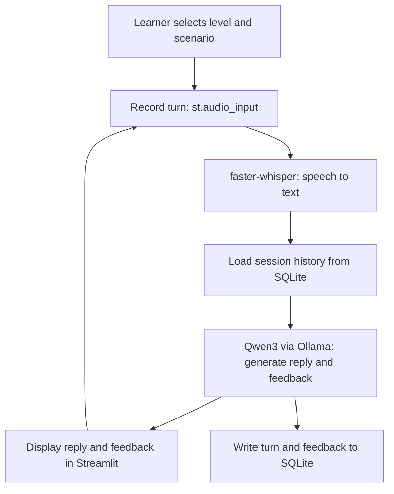

# Implementation Plan: SpeakWell (English PoC)
### CAP 942 — AI Application Development Capstone

---

## 1. Project Title

**SpeakWell — An AI Language Tutor (English Proof of Concept)**

---

## 2. Project Summary

SpeakWell is a locally-run language-tutoring application that lets a learner speak or type a turn in English, receives a reply and short grammar/vocabulary feedback generated by an open-source LLM (Qwen3, served through Ollama), and keeps the conversation's text history in SQLite for the length of the session. The English PoC is the foundation for a future multilingual tutor, but this capstone is scoped to prove the core loop — capture input, generate a tutoring response, give feedback, remember context — works end to end, on your Intel Mac, with no paid APIs.

**Value proposition:** SpeakWell gives learners a private, no-cost, low-pressure partner to practice English conversation with and get immediate, specific feedback.

---

## 3. Problem Statement

- **Problem:** Learners often understand grammar rules abstractly but rarely get to practice live conversation with immediate, targeted correction — human tutors and conversation partners are expensive, scheduled, and not always available.
- **Why it matters:** Repeated, low-stakes conversational practice is one of the most effective ways to build speaking fluency and confidence, but access to it is unevenly distributed.
- **Intended users:** Self-directed English learners (beginner–advanced) who want extra speaking/conversation practice outside a classroom, without paying for a subscription service.

---

## 4. Capstone Requirement Alignment

> You told me to work from the general structure implied by the project template rather than a pasted rubric. That template requires: **user input → open-source LLM → LLM-generated output → a lightweight interface → a database for memory**, built over roughly 4 weeks with no paid APIs or model training. The table below maps SpeakWell to that structure. If your instructor gives you an actual rubric later, slot its exact line items into this table — the plan itself won't need to change much.

| Capstone requirement (general template) | How SpeakWell meets it | Evidence / deliverable |
|---|---|---|
| User input | Learner types a turn, or records one via `st.audio_input` | Streamlit input widget in `app.py` |
| Open-source LLM, used meaningfully | Qwen3-1.7B via Ollama generates tutor replies + feedback | `llm_client.py`; a logged prompt/response pair |
| LLM-generated output shown to user | Reply + 1–2 feedback bullets rendered in the UI | Screenshot / demo video of a session |
| Lightweight interface | Streamlit app running locally | `streamlit run app.py` demo |
| Database for memory | SQLite stores each turn + feedback for the active session | `db.py`; a `.sqlite` file with rows after a demo session |
| No paid APIs / no training | Everything runs locally through Ollama + local Whisper/Kokoro checkpoints | `requirements`/`pyproject.toml` — no paid SDKs |
| Documentation & GitHub submission | README, setup instructions, example I/O | Public (or instructor-shared) GitHub repo |
| Presentation | 5–10 min demo + workflow diagram | Slide deck / live demo |

---

## 5. Project Scope

Your README describes the **full product vision**: live streaming audio, automatic pause detection, a custom Pipecat/WebRTC Streamlit component, Whisper transcription, Kokoro TTS, and Wav2Vec2 pronunciation scoring — all wired together. I want to be direct with you about this, since you said you'd like to keep pursuing the full live-voice version:

**That entire pipeline, built and *validated* end-to-end, is not realistic inside a ~4-week capstone** — even at "intermediate" skill level. Each of these pieces (custom WebRTC audio component, pause detection, phoneme-based pronunciation scoring) is close to a capstone-sized project on its own, and your own README already flags most of them as "not yet validated." Attempting all of it at once is the most common way capstone projects run out of time with nothing demonstrable.

So the plan below keeps the **voice-based, LLM-tutoring core** as the required MVP, using the *simpler* audio path your README itself proposes as a fallback (`st.audio_input`, a completed recording per turn — no live streaming). The full live/streaming pipeline becomes **Phase 2**, attempted only after the MVP works and is demoed, so you always have something submittable.

### MVP (required)
1. A working Python function that calls Qwen3 via Ollama and returns a reply — no UI yet.
2. A tutoring system prompt that produces a reply **and** 1–2 short feedback points (grammar/vocabulary).
3. A Streamlit interface with: level selector (beginner/intermediate/advanced), scenario selector, a way to submit a turn, and a place to show the reply + feedback + transcript.
4. Turn input via **recorded audio** (`st.audio_input`) transcribed with `faster-whisper base.en` — a complete recording per turn, not continuous streaming.
5. SQLite storage of each turn (learner text, tutor reply, feedback) for the active session, reloaded if the session continues.
6. Basic error handling (empty input, Ollama not running, transcription failure).
7. README + setup instructions + a short demo.

### Explicitly out of scope for MVP
- Continuous/live streaming audio (Pipecat + WebRTC custom component).
- Automatic pause detection / turn-taking.
- Wav2Vec2 pronunciation scoring.
- Persistent learner profiles across sessions.
- Any language other than English.
- Streamlit Community Cloud deployment.

### Optional enhancements (attempt only after MVP works and is demo-ready)
Ordered roughly by effort, cheapest first:
1. **Kokoro text-to-speech** for spoken tutor replies (moderate effort, big demo payoff).
2. **Wav2Vec2 phoneme comparison** for a single reference phrase in beginner mode only (bounded, testable version of pronunciation feedback).
3. **Pause-detection + live audio via Pipecat/WebRTC** — the full vision from your README. Time-box this: if it isn't working reliably after ~1 week of the enhancement phase, fall back to the recorded-turn MVP for your submission and document the WebRTC attempt as future work in your README (this is a legitimate, honestly-documented outcome, not a failure).
4. Streamlit Community Cloud experiment with the local backend.

---

## 6. Recommended Technology Stack

| Category | Choice | Why |
|---|---|---|
| Open-source LLM | **Qwen3-1.7B**, served via **Ollama**, `think: false` | Small enough for CPU inference on your 32GB Intel Mac (~1.4GB download); Apache 2.0 licensed; your README already benchmarked it as the default |
| Model inference (LLM) | Ollama local server | Zero-cost, simple REST/python API, handles quantization for you |
| Speech-to-text (MVP) | `faster-whisper base.en`, CPU, INT8 | English-only PoC, CPU-friendly; only drop to `tiny.en` if `base.en` is too slow |
| Speech-to-text framework | Hugging Face Transformers (only if you later need Wav2Vec2) | Needed for the optional pronunciation-analysis enhancement |
| Text-to-speech (optional) | Kokoro-82M | Small, local, no paid API |
| Interface | **Streamlit** | Fast to build a form-based UI; `st.audio_input` gives you a recorded-turn audio widget with no custom JS for the MVP |
| Database | **SQLite** (via Python's built-in `sqlite3`) | Zero-setup, file-based, exactly matches "store this session's turns" — no server needed |
| Dependency management | **uv** | Fast, modern, single tool for venv + lockfile; matches your prompt's stated default |
| Dev tools | VS Code, `ruff` (lint), `pytest` (tests), `git` | Standard, free, no license issues |

**Hardware notes for your Intel Mac (32GB RAM, no GPU acceleration under Ollama):** CPU-only inference is your main constraint, not RAM. Expect noticeably higher latency than a GPU machine — budget extra time in Milestone testing specifically to *measure* reply latency, not just correctness. If `qwen3:1.7b` + `base.en` Whisper together feel too slow for a smooth demo, your fallback order is: (1) drop Whisper to `tiny.en`, (2) shorten system-prompt length and max tokens, (3) as a last resort, demo with typed input and mention voice latency as a known limitation.

---

## 7. Application Workflow (MVP)

**Flow:** the learner picks a level/scenario → records a turn → Whisper transcribes it → the transcript + session history go to Qwen3 with a tutoring system prompt → Qwen3 returns a reply + feedback → both are shown in the UI and written to SQLite → the loop repeats for the next turn.



The open-source LLM (Qwen3) is used at step E — the only step that generates the tutor's actual language: the conversational reply and the grammar/vocabulary feedback. Every other step is deterministic plumbing (recording, transcription, storage, display).

---

## 8. Application Architecture

| Component | Responsibility | Talks to |
|---|---|---|
| `app.py` (Streamlit) | UI: level/scenario selection, audio input, rendering reply + feedback + transcript | `stt.py`, `llm_client.py`, `db.py` |
| `stt.py` | Wraps faster-whisper: audio bytes in → transcript string out | Called by `app.py` |
| `llm_client.py` | Builds the prompt (system prompt + history + new turn), calls Ollama, parses the response into `{reply, feedback}` | Called by `app.py`; reads config from `prompts.py` |
| `prompts.py` | Holds the system prompt template and scenario/level text | Imported by `llm_client.py` |
| `db.py` | Opens/creates the SQLite file, inserts a turn, fetches session history | Called by `app.py` and `llm_client.py` (for history) |
| `errors.py` (small helpers) | Central place for user-facing error messages (Ollama down, empty audio, etc.) | Called from `app.py` |

**Where errors should be handled:**
- *Recording/transcription errors* (silence, no mic permission, empty audio) → caught in `stt.py`, surfaced as a friendly Streamlit warning, turn is not saved.
- *LLM/Ollama errors* (server not running, timeout) → caught in `llm_client.py`, surfaced as a friendly message with a retry button; do not write a broken turn to the database.
- *Database errors* (locked file, write failure) → caught in `db.py`; the session should still display the reply even if saving fails, but should warn the learner that history won't persist.

---

## 9. Proposed Project Structure

```
speakwell/
├── pyproject.toml          # uv-managed project + dependencies
├── README.md                # setup + usage (you'll write this in Milestone 10)
├── implementation_plan.md   # this file
├── app.py                   # Streamlit UI — YOU build this in Milestone 4
├── llm_client.py             # Ollama call + response parsing — Milestones 1–2
├── stt.py                    # faster-whisper wrapper — Milestone 5
├── prompts.py                 # system prompt + scenario text — Milestone 2
├── db.py                       # SQLite helpers — Milestone 3
├── errors.py                   # shared error message helpers — Milestone 8
├── tests/
│   ├── test_llm_client.py
│   ├── test_db.py
│   └── test_stt.py
└── data/
    └── speakwell.sqlite     # created at runtime, not committed to git
```

I'm intentionally not writing the contents of `app.py`, `llm_client.py`, `stt.py`, or `db.py` here — those are what you build in the milestones below. `.gitignore` should exclude `data/*.sqlite` and any `.venv`.

---

## 10. Step-by-Step Development Milestones

### Milestone 0 — Environment Setup
- **Learning objective:** Get a reproducible local environment before writing application code.
- **Concepts to review:** what a virtual environment is; what Ollama does (a local server that runs LLMs).
- **Tasks:** Install `uv`; run `uv init speakwell`; install Ollama; `ollama pull qwen3:1.7b`; confirm `ollama run qwen3:1.7b "hello"` works in a terminal.
- **Coding exercise:** Add `streamlit`, `ollama` (or `requests`), and `pytest` to your `pyproject.toml` with `uv add`.
- **Testing checkpoint:** `ollama run qwen3:1.7b` responds in your terminal.
- **Acceptance criteria:** `uv run python -c "import streamlit"` runs with no error.
- **Common mistakes:** Forgetting Ollama must be *running* (`ollama serve`) before your Python code can call it.
- **What you build yourself:** the whole environment — there's no code here to give you.
- **How you'll know it works:** a terminal LLM reply, with no Python involved yet.

### Milestone 1 — Smallest Working Component: Call the LLM
- **Learning objective:** Prove you can call an open-source LLM from Python before anything else exists.
- **Concepts to review:** HTTP requests or SDK calls; JSON request/response bodies.
- **Tasks:** Write `llm_client.py` with one function, `ask_llm(prompt: str) -> str`, that calls Ollama and returns the text reply. No history, no feedback parsing yet — just prompt in, text out.
- **Coding exercise:** See Guided Example 1 below; extend it into a `.py` file you can run directly.
- **Testing checkpoint:** `uv run python llm_client.py` prints a real reply to a hardcoded test prompt.
- **Acceptance criteria:** Function returns a non-empty string for a simple prompt; a bad prompt (empty string) doesn't crash it.
- **Common mistakes:** Not setting `think: false` (replies get slow/rambly); not handling the case where Ollama isn't running.
- **What you build yourself:** the actual `ask_llm` function body and its error handling.
- **How you'll know it works:** you can call it from a Python REPL and see a sensible reply.

### Milestone 2 — Tutoring Prompt Design (text-only, no UI)
- **Learning objective:** Learn how a system prompt shapes an LLM's behavior and output format.
- **Concepts to review:** system vs. user messages; why asking for structured output (e.g., JSON) makes parsing easier.
- **Tasks:** Write `prompts.py` with a system prompt template (see Section 12) that instructs the model to act as a tutor and return a reply plus 1–2 feedback points. Update `llm_client.py` to build the full prompt from the template + a single learner turn, and to parse the model's structured response into `{reply, feedback}`.
- **Coding exercise:** See Guided Examples 3 and 4 below.
- **Testing checkpoint:** Feed it `"Yesterday I go to the store."` from a terminal script; confirm it returns a reply *and* a grammar correction, not just a generic chat response.
- **Acceptance criteria:** Works for at least 3 different example learner sentences with visibly relevant feedback.
- **Common mistakes:** Asking for free-form text and then trying to regex out the feedback — much harder than asking the model for a simple, consistent format up front.
- **What you build yourself:** the actual prompt wording, the parsing logic, the level/scenario variations.
- **How you'll know it works:** feedback is specific to the sentence you gave, not generic.

### Milestone 3 — Session Memory in SQLite
- **Learning objective:** Persist conversation turns so the tutor has context across a session.
- **Concepts to review:** basic SQL (`CREATE TABLE`, `INSERT`, `SELECT`); why you pass history back into the prompt each turn (the LLM has no memory of its own between calls).
- **Tasks:** Write `db.py` with functions to create the table (if missing), insert a turn, and fetch the last N turns for a session. Update `llm_client.py` to include recent history when building the prompt.
- **Coding exercise:** See Guided Example 3 below and extend it with a `get_history(session_id)` function.
- **Testing checkpoint:** Run two turns in a row from a script; confirm the second LLM call's prompt actually includes the first turn's text.
- **Acceptance criteria:** Turn 2's reply can correctly reference something from turn 1 (e.g., ask a follow-up about what the learner said).
- **Common mistakes:** Passing unlimited history (slows down and eventually exceeds context); not closing DB connections.
- **What you build yourself:** the schema, the insert/fetch functions, and the history length limit you choose.
- **How you'll know it works:** open the `.sqlite` file with a DB browser and see rows appear after each turn.

### Milestone 4 — Streamlit UI (text input first)
- **Learning objective:** Wrap your working backend in a usable interface — text input before audio, to isolate UI bugs from audio bugs.
- **Concepts to review:** Streamlit's rerun model (`st.session_state` for anything you need to persist across reruns).
- **Tasks:** Build `app.py`: level/scenario selectors, a text box for the learner's turn (audio comes in Milestone 5), a submit button, and areas to display the reply, feedback, and transcript history.
- **Coding exercise:** Practice: add a `st.session_state` counter that shows "Turn #N" and increments correctly across reruns.
- **Testing checkpoint:** `streamlit run app.py`; complete a 3-turn text conversation end-to-end.
- **Acceptance criteria:** History displays in order; reply and feedback are visibly distinct in the UI.
- **Common mistakes:** Re-running expensive setup (like loading history) on every keystroke instead of only on submit; losing state between reruns because it wasn't put in `st.session_state`.
- **What you build yourself:** all of `app.py`'s layout and state handling.
- **How you'll know it works:** a full conversation, refresh-proof within the session, visible in the browser.

### Milestone 5 — Recorded-Turn Voice Input
- **Learning objective:** Add speech-to-text without taking on live streaming complexity.
- **Concepts to review:** what a quantized/CPU speech model trades off (speed vs. accuracy); why a *completed recording* is much simpler to handle than a live stream.
- **Tasks:** Write `stt.py` wrapping `faster-whisper base.en`. Replace (or supplement) the Milestone 4 text box with `st.audio_input`, pass the recording into `stt.py`, and feed the transcript into the same pipeline you already built.
- **Coding exercise:** See Guided Example 5 (error handling) — apply it here for "recording too short/silent."
- **Testing checkpoint:** Record yourself saying a sentence with a deliberate grammar mistake; confirm the transcript and the resulting feedback both make sense.
- **Acceptance criteria:** A silent or empty recording produces a friendly warning, not a crash.
- **Common mistakes:** Not handling the audio format Streamlit returns (check what `st.audio_input` gives you — bytes vs. a file-like object — before writing `stt.py`).
- **What you build yourself:** the whole `stt.py` wrapper and its error cases.
- **How you'll know it works:** your own spoken sentence produces a correct transcript most of the time.

### Milestone 6 — Testing, Error Handling, Evaluation Pass
- **Learning objective:** Treat testing as a real milestone, not an afterthought.
- **Concepts to review:** unit vs. end-to-end tests; what "good enough" LLM output evaluation looks like without a formal benchmark.
- **Tasks:** Write the test cases in Section 13. Add the `errors.py` helpers and wire them into `app.py`, `llm_client.py`, `stt.py`. Time at least 5 full turns and record latency.
- **Testing checkpoint:** All 5+ test cases in Section 13 pass or have a documented, understood failure.
- **Acceptance criteria:** No unhandled exception can crash the Streamlit app from user input.
- **Common mistakes:** Only testing the "happy path" (good audio, clear grammar mistake) and skipping edge cases like empty input.
- **What you build yourself:** the tests and the fixes they reveal you need.
- **How you'll know it works:** you can list, in your README, which test cases you ran and what happened.

### Milestone 7 — MVP Freeze, Then (Optional) Phase 2
- **Learning objective:** Recognize when an MVP is "done enough to submit" before spending remaining time on stretch goals.
- **Tasks:** Tag/commit your MVP in git (`git tag mvp-v1`). Only then, time-box an attempt at one enhancement from Section 5 (Kokoro TTS is the lowest-risk next step; live WebRTC audio is the highest-risk).
- **Testing checkpoint:** You can `git checkout mvp-v1` and get a working demo even if Phase 2 work breaks something.
- **Acceptance criteria:** MVP works standalone regardless of how Phase 2 goes.
- **Common mistakes:** Starting Phase 2 work directly on top of MVP code without a safe checkpoint to fall back to.
- **What you build yourself:** whichever enhancement(s) you choose, and the honest documentation of what did/didn't work.
- **How you'll know it works:** your submitted repo runs, even if some README items are marked "attempted, not completed."

---

## 11. Guided Code Examples

*(Five short, isolated examples — each teaches one concept, has a `TODO`, and is not wired into a finished app. You write the connecting logic yourself in the milestones above.)*

### Example 1 — Calling the LLM (Milestone 1)
```python
import requests

def ask_llm(prompt: str) -> str:
    # Ollama's local REST API — no API key, no internet needed
    response = requests.post(
        "http://localhost:11434/api/generate",
        json={
            "model": "qwen3:1.7b",
            "prompt": prompt,
            "think": False,      # keep replies fast and direct
            "stream": False,
        },
        timeout=30,
    )
    response.raise_for_status()
    # TODO: the real response JSON has more fields than just "response" —
    # inspect it once in a REPL and decide what else you might need (e.g. token counts)
    return response.json()["response"]

# Practice task: call this with 3 different prompts and print the results.
# Notice how reply length/quality changes with prompt wording.
```

### Example 2 — Validating Learner Input
```python
def validate_turn(text: str, max_chars: int = 500) -> str | None:
    """Return an error message if the input is unusable, else None."""
    cleaned = text.strip()
    if not cleaned:
        return "I didn't catch anything — try again."
    if len(cleaned) > max_chars:
        return "That's a lot! Try a shorter turn so I can focus feedback."
    # TODO: decide what else counts as "unusable" for your app —
    # e.g. non-English characters only, single-word input, etc.
    return None

# Practice task: call validate_turn() with an empty string, a 600-character
# string, and a normal sentence. Confirm each case behaves as you'd expect.
```

### Example 3 — Reusable SQLite Function
```python
import sqlite3

def save_turn(db_path: str, session_id: str, learner_text: str, reply: str) -> None:
    conn = sqlite3.connect(db_path)
    conn.execute(
        """CREATE TABLE IF NOT EXISTS turns
           (session_id TEXT, learner_text TEXT, reply TEXT)"""
    )
    conn.execute(
        "INSERT INTO turns VALUES (?, ?, ?)",
        (session_id, learner_text, reply),
    )
    conn.commit()
    conn.close()
    # TODO: add a timestamp column and a get_history(db_path, session_id, limit)
    # function that returns the last N rows for a session — you'll need this
    # in Milestone 3 to give the LLM conversation context.

# Practice task: call save_turn() twice with the same session_id, then open
# the .sqlite file (e.g. with the "DB Browser for SQLite" app) to see both rows.
```

### Example 4 — Processing a Structured Model Response
```python
import json

def parse_tutor_response(raw_text: str) -> dict:
    """Expects the LLM to have returned a JSON object like:
       {"reply": "...", "feedback": ["...", "..."]}"""
    try:
        data = json.loads(raw_text)
    except json.JSONDecodeError:
        # TODO: decide your fallback — retry with a stricter prompt?
        # Return the raw text as the reply with empty feedback? Your call.
        return {"reply": raw_text, "feedback": []}
    return {
        "reply": data.get("reply", ""),
        "feedback": data.get("feedback", []),
    }

# Practice task: test this with a valid JSON string, a plain-text (non-JSON)
# string, and a JSON object missing the "feedback" key. Confirm no crashes.
```

### Example 5 — Handling One Common Error (Ollama not running)
```python
import requests

def ask_llm_safely(prompt: str) -> str:
    try:
        r = requests.post(
            "http://localhost:11434/api/generate",
            json={"model": "qwen3:1.7b", "prompt": prompt, "think": False, "stream": False},
            timeout=10,
        )
        r.raise_for_status()
        return r.json()["response"]
    except requests.ConnectionError:
        # TODO: this is the message a learner will see if Ollama isn't running —
        # write one that actually tells them what to do about it
        return "TUTOR_UNAVAILABLE"
    except requests.Timeout:
        return "TUTOR_TIMEOUT"

# Practice task: stop Ollama (or block its port) and confirm this returns
# "TUTOR_UNAVAILABLE" instead of crashing your Streamlit app.
```

---

## 12. Prompt-Engineering Plan

**Purpose of the system prompt:** define the model's role (a patient, encouraging English tutor), the expected response shape (reply + feedback, as parseable JSON), and constraints (keep replies short; correct at most 1–2 things per turn; don't lecture).

**Information the user provides:** practice level (beginner/intermediate/advanced), scenario (e.g., "ordering food"), and their spoken/typed turn.

**Expected response format (JSON):**
```json
{"reply": "string — the tutor's conversational reply", "feedback": ["string", "string (optional)"]}
```

**Example prompt template (placeholders in `{}`):**
```
SYSTEM:
You are an encouraging English conversation tutor for a {level} learner
practicing the scenario "{scenario}". Respond ONLY with a JSON object:
{"reply": "...", "feedback": ["...", "..."]}
- "reply" continues the conversation naturally and asks a follow-up question.
- "feedback" has 1–2 short, specific corrections (grammar or vocabulary) if
  the learner made a mistake, or an empty list if the sentence was correct.
- Do not include anything outside the JSON object.

CONVERSATION SO FAR:
{recent_history}

LEARNER: {learner_text}
```

**Reducing unclear or unsupported responses:**
- Explicitly require JSON-only output (no preamble) — this is the single biggest lever for parseable, on-format replies.
- Keep `max history` short (e.g., last 4–6 turns) so the model doesn't lose the instruction in a long context.
- If `parse_tutor_response` (Example 4) fails to parse JSON, retry once with a stricter reminder appended ("Respond with ONLY the JSON object, nothing else.") before falling back to a generic error message.
- Avoid asking the model to grade pronunciation from text alone — that's not something a text LLM can honestly do; keep pronunciation claims out of the LLM's job entirely (see Section 14).

---

## 13. Testing Plan

**Unit tests:** `validate_turn()`, `parse_tutor_response()`, `save_turn()`/history fetch, and `stt.py`'s handling of an empty audio buffer.

**End-to-end tests:** run a full 3-turn conversation through the Streamlit app and confirm history, reply, and feedback all display correctly.

**At least five realistic test cases:**

| # | Input | Expected behavior |
|---|---|---|
| 1 | Typed sentence with an obvious grammar mistake ("Yesterday I go to the store.") | Feedback mentions the tense error specifically |
| 2 | Grammatically correct sentence | `feedback` list is empty or minimal; reply still continues the conversation |
| 3 | Empty/blank input submitted | `validate_turn` blocks it; no LLM call made; friendly warning shown |
| 4 | Silent or near-silent audio recording | `stt.py` returns an empty/low-confidence transcript; app shows a "didn't catch that" message, doesn't call the LLM with junk text |
| 5 | Ollama server stopped | App shows "TUTOR_UNAVAILABLE" message instead of crashing |
| 6 (stretch) | Very long rambling input (>500 chars) | `validate_turn` asks for a shorter turn |

**LLM output quality — a simple evaluation method (no formal benchmark needed):** After each of your 5+ test conversations, rate the tutor's feedback on a 1–3 scale yourself: (1) wrong/irrelevant, (2) partially right, (3) correct and specific. Keep a small table of these ratings in your README as your evaluation evidence — this is a legitimate, lightweight way to show you assessed LLM output quality without needing a labeled dataset.

---

## 14. Privacy, Security, Accessibility, and Responsible-AI Considerations

**Relevant risks:**
- Audio recordings briefly touch disk/memory for transcription — treat them as sensitive, don't log or persist raw audio beyond what's needed.
- LLM-generated grammar corrections can be wrong; presenting them with false confidence could teach an error.
- If you ever add the optional public frontend, session data would leave the local machine.

**Project limitations (state these plainly in your README):**
- This is a single-learner, single-session tool — no accounts, no persistent learner profiles.
- Feedback comes from a small local model and has not been validated against a professional curriculum.
- Speech-to-text accuracy depends on microphone quality and background noise.

**Ways to reduce these risks:**
- Don't retain raw audio after transcription (transcribe, discard the audio buffer).
- Label feedback in the UI as "suggested correction" rather than an authoritative grade.
- Keep the LLM's role to *reply + feedback text* only — never have it (or any component) issue a numeric "pronunciation score" without the Wav2Vec2 evidence backing it, and even then, present it as experimental.

**Claims the application should not make:**
- "Certified" or standardized proficiency assessment.
- Guaranteed grammatical correctness of its own feedback.
- Real-time pronunciation grading (unless and until the Wav2Vec2 enhancement is built and clearly labeled experimental).
- Data privacy guarantees beyond "runs locally, audio isn't persisted" — don't imply more than that.

---

## 15. Documentation and GitHub Plan

**README sections:** Project summary, current status (MVP vs. stretch features), setup instructions, how to run, example input/output, limitations, roadmap (you can adapt your existing README's roadmap checklist).

**Setup instructions to include:** installing `uv`, `uv sync`, installing Ollama + pulling `qwen3:1.7b`, any OS-specific notes for Intel Mac + Ollama, running `streamlit run app.py`.

**Dependency documentation:** keep `pyproject.toml`/`uv.lock` committed; briefly explain in the README why each major dependency (Ollama, faster-whisper, Streamlit) is there.

**Instructions for running the application:** exact commands, in order, from a clean clone.

**Example inputs and outputs:** include 2–3 real transcript/reply/feedback triples from your own testing (Section 13) as a table or screenshots.

**GitHub submission checklist:**
- [ ] `.gitignore` excludes `.venv/`, `data/*.sqlite`, any `.env`
- [ ] README reflects what's actually implemented, not just the original vision
- [ ] Setup instructions tested on a clean checkout
- [ ] At least one tagged commit for the MVP (`mvp-v1`)
- [ ] Tests included and passing (`uv run pytest`)
- [ ] License file added (pick one — MIT is a common default for a class project)

---

## 16. Presentation Plan (5–10 minutes)

1. **Problem + value prop** (~1 min) — why conversation practice is hard to access.
2. **Workflow diagram walkthrough** (~1–2 min) — show the Mermaid diagram from Section 7, point out exactly where the LLM is used.
3. **Live demo** (~3–4 min): record one turn with an intentional grammar mistake → show transcript → show reply + feedback → show a second turn that references the first (proving memory works) → open the SQLite file briefly to show stored history.
4. **Challenges and lessons learned** (~1–2 min) — be honest about latency on CPU, JSON-parsing reliability, and (if attempted) what happened with the Phase 2 live-audio work.
5. **Next steps** (~1 min) — Kokoro TTS, Wav2Vec2 pronunciation, live WebRTC audio, additional languages.

---

## 17. Suggested Timeline (≈4 weeks / 8 sessions, 2 sessions per week)

| Session | Focus |
|---|---|
| 1 | Milestone 0 (setup) + start Milestone 1 (call LLM) |
| 2 | Finish Milestone 1, start Milestone 2 (tutoring prompt + parsing) |
| 3 | Finish Milestone 2, start Milestone 3 (SQLite memory) |
| 4 | Finish Milestone 3, start Milestone 4 (Streamlit text UI) |
| 5 | Finish Milestone 4 |
| 6 | Milestone 5 (recorded-turn voice input) |
| 7 | Milestone 6 (testing, error handling, evaluation pass) — **MVP should be feature-complete by end of this session** |
| 8 | Milestone 7: tag MVP, attempt one Phase 2 enhancement if time allows, finish README + prep presentation |

---

## 18. Definition of Done

- [ ] `ask_llm` reliably returns a reply from Qwen3 via Ollama
- [ ] System prompt reliably produces parseable `{reply, feedback}` JSON across varied inputs
- [ ] Learner can complete a multi-turn session with visible, relevant feedback
- [ ] A recorded voice turn is transcribed and used correctly (MVP audio path, not live streaming)
- [ ] Session turns are persisted in SQLite and reloaded correctly within a session
- [ ] All 5+ test cases from Section 13 pass or have documented, understood failures
- [ ] App doesn't crash on empty input, silent audio, or Ollama being offline
- [ ] README accurately describes what's implemented vs. what's future work
- [ ] Repo is committed, tagged at `mvp-v1`, and has a license
- [ ] Presentation covers problem, workflow diagram, live demo, and honest lessons learned
- [ ] Responsible-AI limitations (Section 14) are stated in the README, not just this plan
